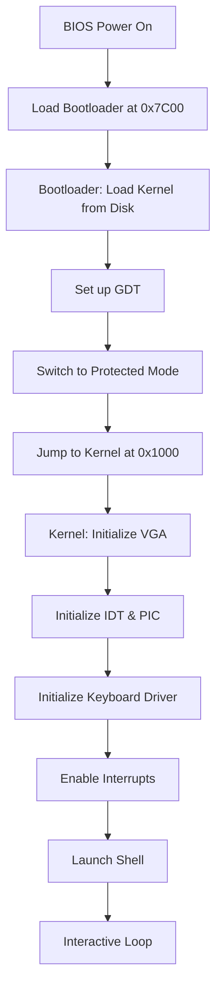
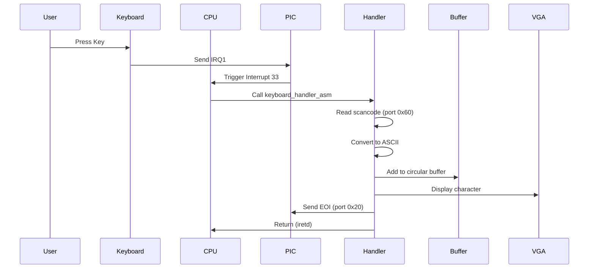

# ValcOS Architecture Documentation

## Overview

ValcOS is a simple x86 operating system built from scratch. It demonstrates fundamental OS concepts including bootloading, protected mode switching, interrupt handling, and basic I/O.

## Boot Process

## Memory Map

| Address Range | Purpose |
|--------------|---------|
| 0x00000000 - 0x000003FF | Real Mode IVT (not used in protected mode) |
| 0x00000400 - 0x000004FF | BIOS Data Area |
| 0x00000500 - 0x00007BFF | Free memory |
| 0x00007C00 - 0x00007DFF | Bootloader (512 bytes) |
| 0x00007E00 - 0x0007FFFF | Free memory |
| 0x00080000 - 0x0009FFFF | Extended BIOS Data Area |
| 0x000A0000 - 0x000BFFFF | Video memory |
| 0x000B8000 - 0x000B8FA0 | VGA Text Buffer (80x25) |
| 0x000C0000 - 0x000FFFFF | BIOS ROM |
| 0x00001000 - 0x???????? | **Kernel Code & Data** |
| 0x00090000 | **Kernel Stack Top** |

## Component Architecture

### Bootloader (`boot/boot.asm`)
- **Size**: 512 bytes (one sector)
- **Location**: Loaded at 0x7C00 by BIOS
- **Responsibilities**:
  - Load kernel from disk (sectors 2-21)
  - Set up Global Descriptor Table (GDT)
  - Switch from 16-bit real mode to 32-bit protected mode
  - Jump to kernel entry point

### Kernel (`kernel/`)

#### Entry Point (`kernel_entry.asm`)
- Sets up 16KB stack
- Calls C `kernel_main()` function
- Provides assembly wrappers for interrupts

#### Main Kernel (`kernel.c`)
- Initializes all subsystems
- Launches the shell
- Main event loop

#### Interrupt Handling (`idt.c`)
- 256-entry Interrupt Descriptor Table
- PIC remapping (IRQs 0-15 → interrupts 32-47)
- Enables keyboard interrupt (IRQ1)

#### String Utilities (`string.c`)
- Custom implementations of standard functions
- No dependency on libc

#### Shell (`shell.c`)
- Command-line interface
- Built-in commands: `help`, `clear`, `about`, `echo`
- Command parsing and execution

### Drivers (`drivers/`)

#### VGA Driver (`vga.c`)
- Direct memory access to 0xB8000
- 80x25 character display
- 16-color support
- Automatic scrolling

#### Keyboard Driver (`keyboard.c`)
- PS/2 keyboard support via IRQ1
- Scancode to ASCII conversion
- Circular input buffer
- Interrupt-driven input

## Interrupt Handling Flow

## Build System

The Makefile orchestrates the build process:

1. **Assemble bootloader** (NASM, binary output)
2. **Assemble kernel entry** (NASM, ELF32 object)
3. **Compile C sources** (GCC with `-m32 -ffreestanding`)
4. **Link kernel** (LD with custom linker script)
5. **Concatenate** bootloader + kernel
6. **Pad to 1.44MB** (floppy disk size)

## Future Expansion

Potential features for future versions:

- **Memory Management**: Paging, heap allocator
- **Filesystem**: FAT12/FAT16 support
- **Multitasking**: Process scheduling, context switching
- **System Calls**: User/kernel mode separation
- **Additional Drivers**: Timer, mouse, serial port
- **Networking**: Basic TCP/IP stack
- **Graphics**: VESA VBE modes

## Technical Details

### GDT Configuration
- **Null Descriptor**: Required by x86 architecture
- **Code Segment**: Base 0x00000000, Limit 0xFFFFF, 4KB granularity
- **Data Segment**: Base 0x00000000, Limit 0xFFFFF, 4KB granularity

### IDT Configuration
- **256 entries** (0-255)
- **Interrupt 33**: Keyboard (IRQ1)
- **Gate type**: 32-bit interrupt gate (0x8E)
- **Selector**: 0x08 (code segment)

### PIC Remapping
- **Master PIC**: IRQs 0-7 → Interrupts 32-39
- **Slave PIC**: IRQs 8-15 → Interrupts 40-47
- **Reason**: Avoid conflict with CPU exceptions (0-31)
